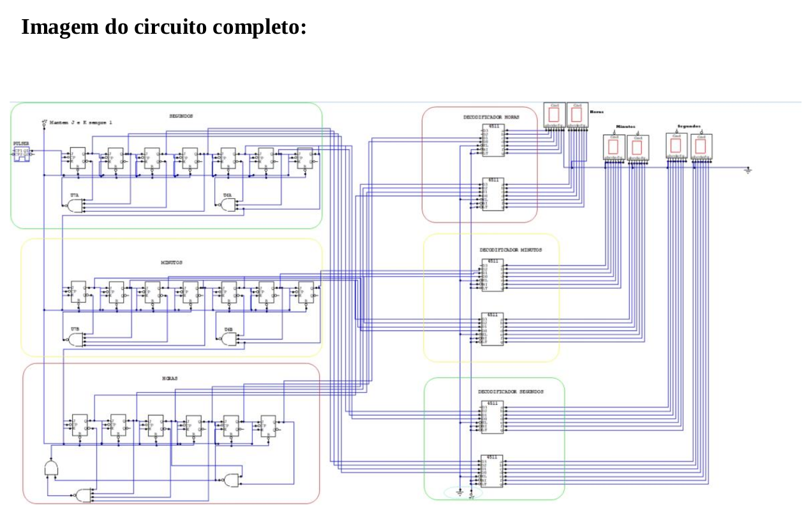

## Trabalho de circuitos digitais para a criação de um relógio digital de 24horas.

## Autor 
Matheus Andrade - ra109977 (https://github.com/MatheusINFO)

## Descrição
O circuito tem um total de 20 Flip-Flop J-K, sendo dos 20, 7 para os segundos, 7
para os minutos e 6 para as horas, além disso foram usados 6 decodificadores, 6 display
de 7 segmentos, 6 portas NAND, 2 Ground, 2 V+ e 1 pulser.

## Circuito completo

  

